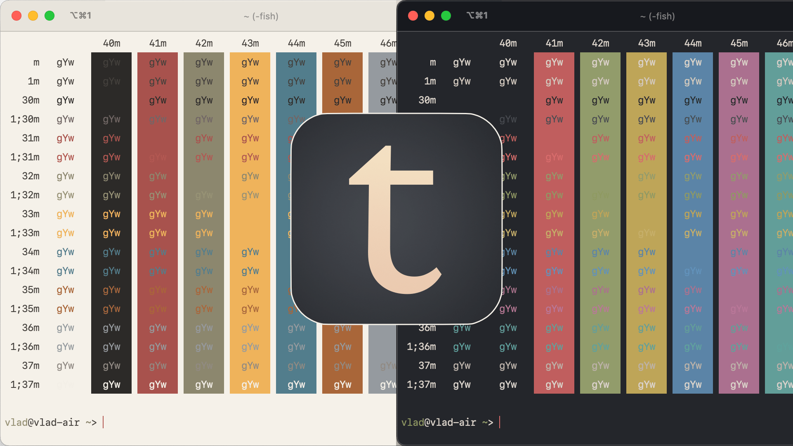

## Tiniri theme for [iTerm2](https://iterm2.com/)

Part of Tiniri set. Download other themes and wallpapers:

[tiniri.vlad.studio](https://tiniri.vlad.studio/)

---

To install:

- download `itermcolors` files (right-click and Save As...):
  - [Tiniri Dark.itermcolors](https://raw.githubusercontent.com/vladstudio/tiniri-iterm2/main/Tiniri%20Dark.itermcolors)
  - [Tiniri Light.itermcolors](https://raw.githubusercontent.com/vladstudio/tiniri-iterm2/main/Tiniri%20Light.itermcolors)
- open Iterm2
- open Settings
- select Profiles -> Colors, click Color Presets, select Import
- enjoy :-)